# PubNub FinTech Demo

Application to show how PubNub can add real-time features to your FinTech solution and improve the user experience.

## Why PubNub for your P2P payment app?

Peer-to-peer payments can be enhanced using PubNub in a variety of ways:

- Real-time chat so users do not have to leave your app to send messages
- Chat history that can also hold receipt and payment history, so everything is in the same place
- Emoji / reactions can be added to both chat messages and payment notifications
- Read receipts so you know when messages have been read, or payment notifications seen.
- Seamless integration with Push Notifications (GCM for Android and APNS for iOS) so users always see your messages, even when your app is closed.
- File sharing: enhance your payment notifications with custom images or templates
- Typing indicators  & message moderation

**Real-time:** <30ms global delivery, regardless of concurrency. 

**Scale:** We handle 3 Trillion real-time API calls every month.  

**Stability:** 99.999% SLA provided for all customers

**Compliance:** We support compliance for regulatory environments that include ISO 27001, HIPAA, GDPR, SOC2 Type 2, and CCPA

## Demo

> This demo will give you an impression of the kind of real-time features you could add to your P2P payment app using PubNub.  The demo is written in our [TypeScript Chat SDK](https://www.pubnub.com/docs/chat/chat-sdk/overview) to make hosting easier but we also cater to native mobile apps with our Chat SDKs for [Android / Kotlin](https://www.pubnub.com/docs/chat/kotlin-chat-sdk/overview) and [iOS / Swift](https://www.pubnub.com/docs/chat/swift-chat-sdk/overview).  All the real-time messaging features are real, except for the push notifications for obvious reasons.  In production, your P2P payment app will be speaking to a dedicated backend, but this demo is designed to run locally within the browser.

A hosted version of this demo can be found at **[https://pubnub-fintech-demo.netlify.app](https://pubnub-fintech-demo.netlify.app)**

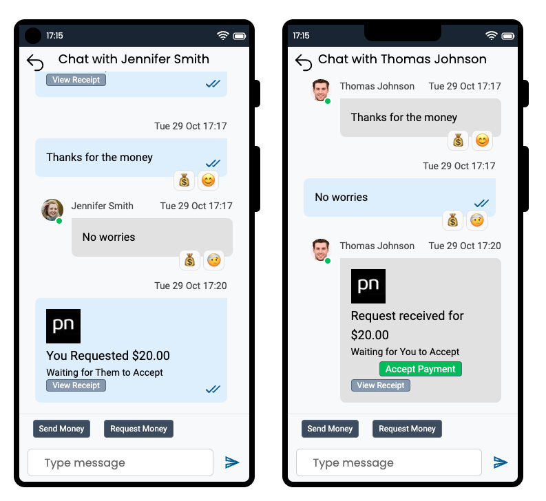

**This demo is for educational purposes only, and contains only minimal error checking.**

## Installation / Getting Started

This application is written with NextJS, so be sure to have a copy of [Node.js 18.17](https://nodejs.org/) or later installed.

To run this project yourself you will need a PubNub account

### Get Your PubNub Keys

1. You’ll first need to sign up for a [PubNub account](https://admin.pubnub.com/signup/). Once you sign up, you can get your unique PubNub keys from the [PubNub Developer Portal](https://admin.pubnub.com/).

1. Sign in to your [PubNub Dashboard](https://admin.pubnub.com/).

1. Click Apps, then **Create New App**.

1. Give your app a name, and click **Create**.

1. Click your new app to open its settings, then click its keyset.

1. Enable the Stream Controller feature on your keyset (this should be enabled by default after you created the keyset)

1. Enable the Message Persistence feature on your keyset and choose a duration

1. Enable the App Context feature.

1. Enable the File Sharing feature.

1. Copy the Publish and Subscribe keys and paste them into your app as specified in the next step.

## Building and Running

1. Clone the repository

1. Replace the `.env.sample` file with a `.env` file and populate it with the publish and subscribe keys you generated in the previous step.

1. `yarn install`

1. `yarn dev`

1. You can now navigate to `localhost:3000` in your browser.  The first time you run the application on a new keyset it will have to first do some initialization, which will take a few seconds.

# Features

The demo simulates two mobile devices allowing you to log in and communicate between two users without launching a separate tab.

## Logging in

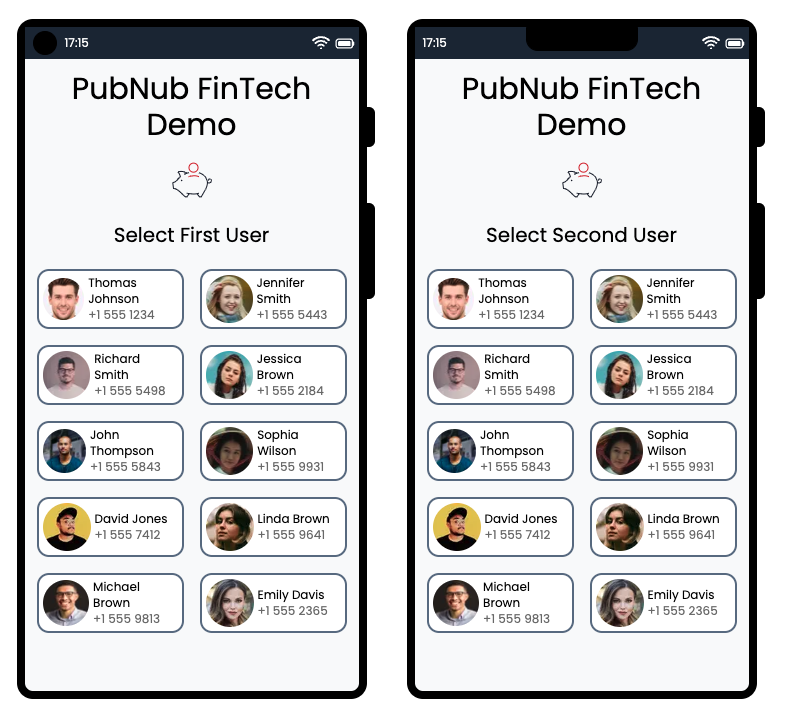

Your P2P payment application will already have a login screen for registered users, as well as some way for new users to sign up for your app (probably using their mobile number).

For simplicity this demo allows you to choose two users to log in as.  

## Direct Channels

This demo uses direct (or 1:1) channels, which are designed for two participants to engage in a private conversation.  Learn more about private conversations in our [documentation for channel creation](https://www.pubnub.com/docs/chat/chat-sdk/build/features/channels/create#create-direct-channel).

PubNub also supports public and group channels, though they are not used in this demo.

## Sending and Receiving Messages

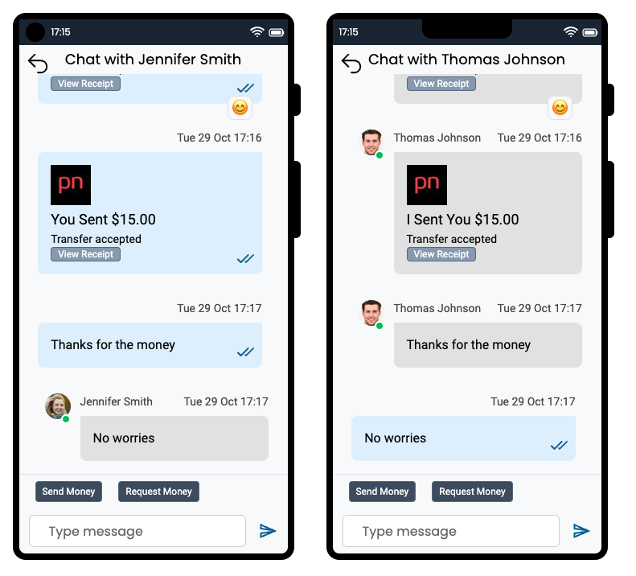

This demo uses PubNub for all message exchange with messages being sent using the [channel.sendText() API](https://www.pubnub.com/docs/chat/chat-sdk/build/features/messages/send-receive).  

You can send messages securely to users:

- To notify them when they receive a new payment
- When a payment status changes
- When a bill is due
- Receipt details
- To notify them there is a problem with the payment
- To send a (non-payment) chat message.  
- etc.

## Sending and Requesting Payments

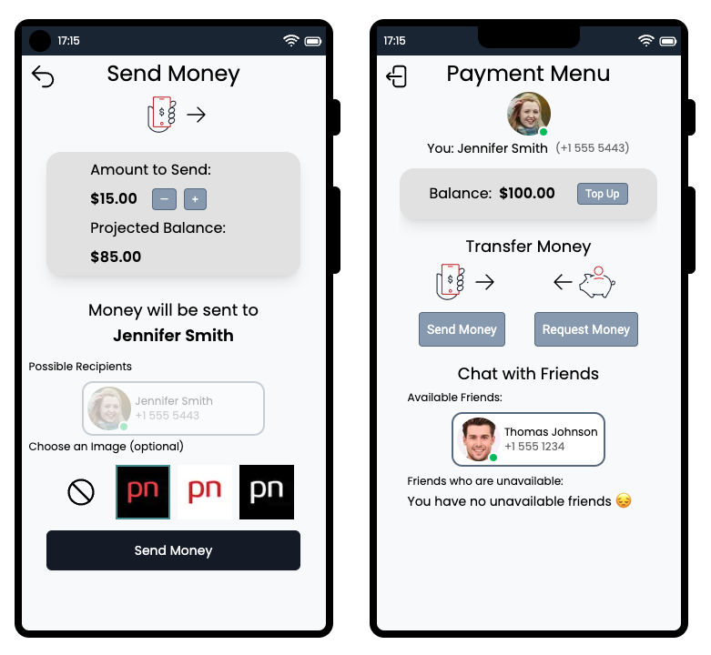

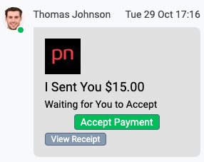

You can't have a payment demo without the ability to send or request money, but since PubNub does not offer financial backend services, this portion of the application is fully mocked.  Although the *balance* will be affected when you transfer payments, you can easily 'Top Up' that balance or just log out and in again, to return the balance to the default amount.

## Chat History

All PubNub messages are backed on the server, so you can quickly retrieve all historic messages in any chat.  See our documentation on [Message Persistence](https://www.pubnub.com/docs/general/storage) for more information, which also explains how to configure the duration messages are stored for - if you have specific questions around security or compliance, our PubNub solution architects are happy to assist. 

## React to a Message (Emoji)

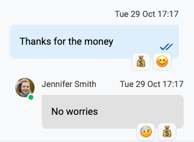

The PubNub Chat SDK supports [Message Reactions](https://www.pubnub.com/docs/chat/chat-sdk/build/features/messages/reactions) allowing you to easily add a reaction to any message, and be notified when others have added a message reaction in real-time.  You can customize the solution to use any emoji you like, as long as it is supported by the platform (i.e. browser or mobile device)

## Read Receipts

PubNub [guarantees message delivery](https://www.pubnub.com/message-delivery-guarantee/).  One way we do this is through read receipts, so users can see when their messages have been read.  

The Chat SDK workflow for [Read Receipts](https://www.pubnub.com/docs/chat/chat-sdk/build/features/messages/read-receipts) is as follows:

1. A message is sent
2. That message is received
3. The recipient marks the message as read
4. The sender receives notification that the message is read.

## File Sharing

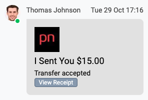

Liven up your payment transfers by associating images: 

- Paying your friends for a holiday?  Use a beach image.
- Paying your grandparents back for that zero-interest loan?  Use a car image.

PubNub allows you to easily exchange images along with any message (including payment notifications)

## Typing Indicator

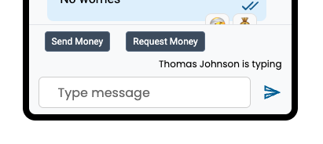

The PubNub Chat SDK [Typing Indicator](https://www.pubnub.com/docs/chat/chat-sdk/build/features/channels/typing-indicator) makes it trivial to implement an indicator without worrying about timeouts and resetting timers.

## Push Notifications

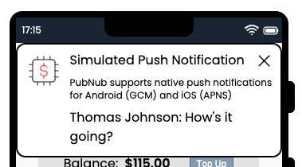

PubNub supports [Mobile Push Notifications](https://www.pubnub.com/docs/chat/chat-sdk/build/features/push-notifications), i.e. GCM on Android and APNS on iOS.  

For this demo, I did not want to use real push notifications as that requires either a real iOS device, or an Android emulator - and that makes it more difficult to run the demo.  I wanted to at least simulate push messages however to make it easier to imagine the workflow.

We do have a hosted [push demo for Android](https://www.pubnub.com/demos/push/), if you want to see something real - that uses a cloud-based emulator rendered within the browser. 

## User Presence

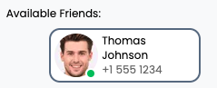

This demo will always show users as online, but for more information about how PubNub allows you to see the `online` or `offline` status for each of your users, either globally or at the channel level, please see our [Presence documentation](https://www.pubnub.com/docs/chat/chat-sdk/build/features/users/presence).

## Payment Receipts

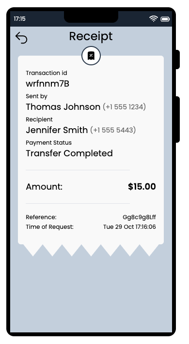

This demo will allow you to see a rudimentary receipt screen.  Receipt data can be sent to users when a transaction status changes, or when a payment is completed.

# Contributing

Please fork the repository if you'd like to contribute. Pull requests are always welcome.

